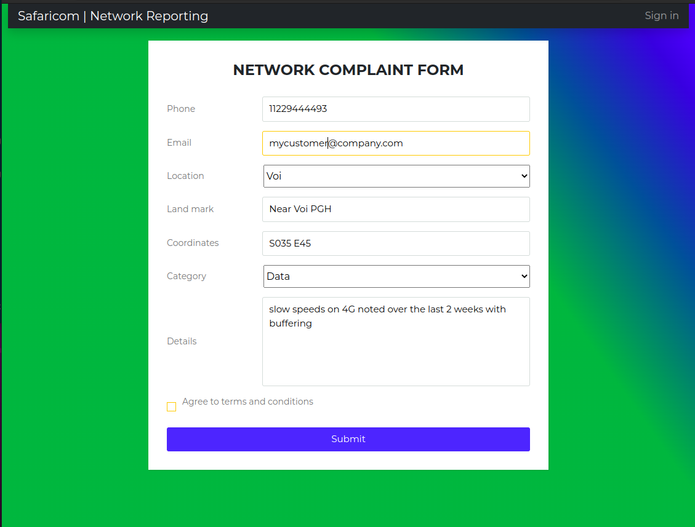
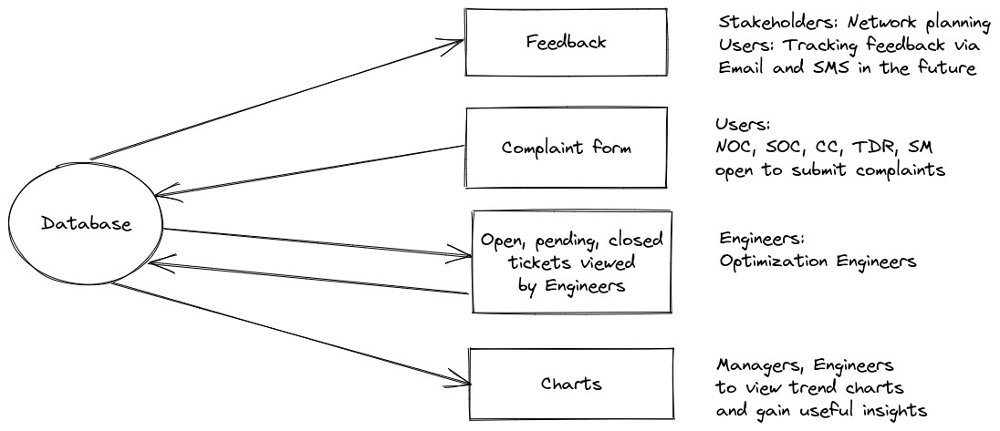
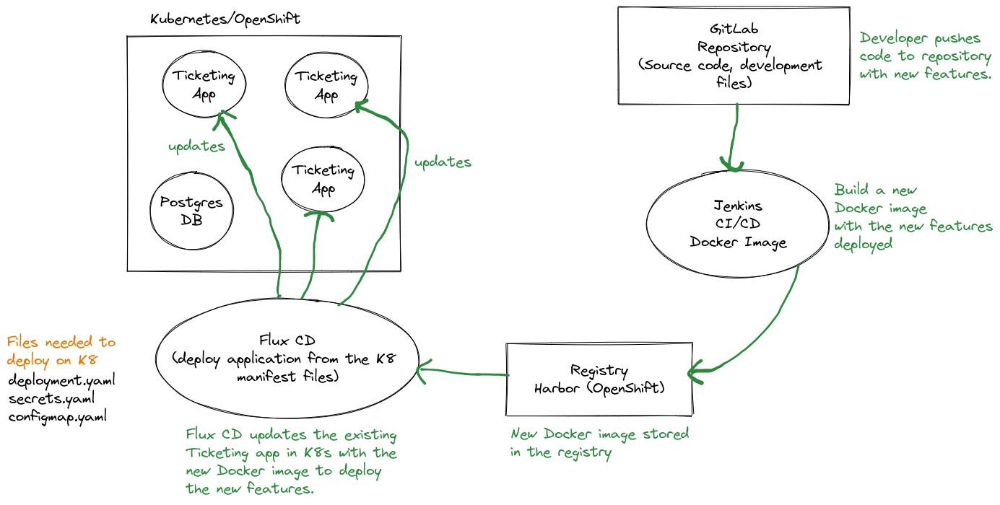
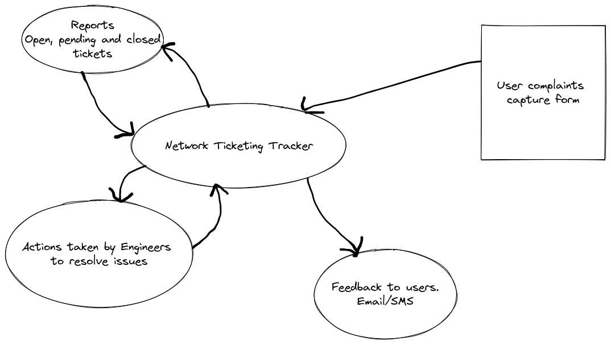

# Network Complaints Ticketing System

## Objectives
This is the main project repository. We look towards building an interface that will be able to link various cross functional teams within the ogranization for purposes of improving the communications as relates to customer complaints. The main teams involved are: Customer care, NOC, SOC and Optimization teams. From receipt of complaints to evaluation to forwarding to the team concerned with analysis, faulting and resolution, there is a need for seamless flow of work, quick and up to date feedback and accurate tracking of issues raised up to the point that each case is closed either via resolution or action that would be carried out at a future date. The tool being developed also needs to be able to allow a user to check subsequent complaints by the same user, flag repeat complaints and allow users to feedback status to our customers. It is hoped that the tool would be simple to use, effective in giving accurate information as well as being easy to update and also track precisely the movement of work and information..

## Installation

### Requirements
* Python3 
* Docker
* HTML
* CSS

#### Clone the project
```
git clone
cd folder
```
#### Create a virtual environment and install dependencies
This will install Django and the required dependencies
```
python3 -m venv /opt/ticket_env
source /opt/ticket_env/bin/activate
pip install -r requirements.txt
```

#### Run database migrations
To create the database models, run the commands in the terminal
```
python manage.py makemigrations
python manage.py migrate
python manage.py createsuperuser (and follow instructions)
```
#### How to run the project
Once all the dependencies are installed, run the following command in the terminal
```
python manage.py runserver
```
Open your browser and visit http://entdevnet.safaricom.net:8035/

## Technologies used
* Python/Django
* Postgres Database
* ChartJS
* HTML5
* Bootstrap5

## System Architecture


## CI/CD Plan


## System structure


## Implemented Design


## Project contributors
* Moses Kubo
* Kelvin Kangwe
* Mark Waihenya


